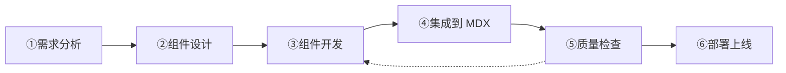

# remuse 章节真可视化组件开发 skill

把章节从"文字卡片式图解"升级为"字节级/结构级真可视化"的标准流程。**SDS 章节（redis-design-implementation/02-simple-dynamic-string）是已上线的参考范例**，本 skill 将其重复性劳动标准化。

---

## 一、工作流程（6 步法）



### 步 1：需求分析

1. 读章节 MDX，摘取核心概念、数据结构、流程步骤
2. 确定最适合的图表类型：

| 概念类型 | 推荐图表 | 示例 |
|---|---|---|
| 内存/数据结构布局 | 逐字节格图 | SDS 的 len/free/buf 字节内存布局 |
| 算法/流程/多步骤 | 流水线 + 节点详情 | 渐进 rehash 三步、扩容流程 |
| 架构/组件关系 | 组件图 + 箭头 | 对象系统 type/encoding/refcount |
| 时序/状态变迁 | 状态机 + 事件 | 哨兵故障转移时序 |
| 对比/策略差异 | 并排对比 + 标注 | 三种 fsync 策略对比 |
| 多层级结构 | 分层索引图 | 跳表多层索引、LSM 层次 |

3. 确定交互方式：点击节点看详情、按钮切换状态、故障注入开关、重置

### 步 2：组件设计

1. 确定颜色方案（从 C 常量取色，见开发规范 §2.1）
2. 确定 SVG viewBox 尺寸（宽度 780-900，高度 260-360）
3. 设计节点布局（横向流水线，3-5 节点）
4. 设计交互面板（按钮行、状态条、详情面板、日志面板）
5. 参考现有范例：`src/components/mdx/redis-design-implementation/rdi-sds-layout-lab.tsx`

### 步 3：组件开发

按开发规范（§2）创建组件文件，放在：
```
src/components/mdx/<book-slug>/<component-name>.tsx
```

### 步 4：集成到 MDX

1. 创建 v2 bridge 文件并导出组件
2. MDX 中 import 替换 + 组件插入
3. 重跑 chapter-component-registry 生成脚本
4. 验证 tsc --noEmit

### 步 5：质量检查

执行质量检查命令序列（§3），确保全部通过。

### 步 6：部署上线

按部署流程（§4）操作。

---

## 二、组件开发规范

### 2.1 组件模板

```tsx
"use client";

import { useState, useCallback } from "react";

const C = {
  bg: "var(--bg)",
  elevated: "var(--bg-elevated)",
  border: "var(--border)",
  primary: "var(--text-primary)",
  secondary: "var(--text-secondary)",
  accent: "var(--accent)",
  danger: "var(--danger)",
  success: "var(--success)",
  warning: "var(--warning)",
} as const;

type NodeSpec = {
  id: string;
  label: string;
  title: string;
  content: string;
  failure?: { title: string; desc: string };
};

type ChapterSpec = { title: string; subtitle: string; nodes: NodeSpec[] };

export function XxxLab() {
  const [selected, setSelected] = useState(spec.nodes[0].id);
  const [injectFaults, setInjectFaults] = useState(false);
  const reset = useCallback(() => { setSelected(spec.nodes[0].id); setInjectFaults(false); }, []);

  return (
    <div className="not-prose overflow-hidden rounded-card border border-border bg-elevated">
      {/* Header: 标题 + 重置按钮 */}
      <div className="flex items-center justify-between border-b border-border px-4 py-3">
        <span className="text-sm font-medium" style={{ color: C.primary }}>⚡ 标题</span>
        <button onClick={reset} className="rounded-control border border-border px-3 py-1 text-xs transition-colors hover:border-accent" style={{ color: C.secondary }}>重置</button>
      </div>
      <div className="p-4">
        <svg viewBox="0 0 900 360" className="w-full" role="img" aria-label="标题">
          {/* SVG 内容 */}
        </svg>
        {/* 操作按钮 */}
        <div className="mt-2 flex flex-wrap items-center gap-2">...</div>
        {/* 详情面板 */}
        <div className="mt-3 rounded-control border border-border p-3" style={{ background: C.bg }}>...</div>
        {/* 故障注入开关 */}
        <label className="mt-4 flex cursor-pointer items-center gap-3">
          <button onClick={() => setInjectFaults(!injectFaults)} className="relative h-5 w-9 rounded-full border border-border transition-colors" style={{ background: injectFaults ? C.accent : C.elevated }} aria-label="注入常见故障">
            <span className="absolute top-0.5 h-4 w-4 rounded-full bg-white transition-transform" style={{ transform: injectFaults ? "translateX(16px)" : "translateX(0)" }} />
          </button>
          <span className="text-sm" style={{ color: C.secondary }}>注入常见故障</span>
        </label>
      </div>
    </div>
  );
}
```

### 2.2 SVG 可视化铁律

1. **所有 SVG 文字 fontSize ≥ 11**（巡检阈值 <11 会报 svg-text-too-small 导致 FAIL）
2. **viewBox 宽度固定 780-900，高度≥330**（确保 mobile 视口 390px 下渲染高度 ≥120px，通过 core-evidence-target-invalid 检查：viewBox 高 = 330 × 390/780 ≈ 165 ≥ 120 ✓）
3. **外层容器 `className="not-prose"`**（避免巡检选择器 `article .prose svg` 双重匹配，但 not-prose 内的 svg 仍会被 candidate 选择器捕获）
4. **svg 必须有 `role="img"` + `aria-label`**（可访问性要求）
5. **颜色用 C 常量**（从 CSS 变量取色，支持主题切换），禁止硬编码 hex
6. **使用 `<g>` 分组 + `key` 属性管理 SVG 子元素**
7. **文字用 `<text>` 而非 `<foreignObject>`**（hydration 兼容性）

### 2.3 交互要求

1. 至少有一个可点击/切换的交互控件（按钮或开关）
2. **必须有重置按钮**（含"重置"文本，巡检检测 resetCount）
3. 交互操作要有可见的状态变化（巡检检测 interactionChanged）
4. 故障注入开关（可选但推荐）：用 toggle 按钮切换，高亮故障节点

### 2.4 布局规范

```
┌──────────────────────────────────┐
│ ⚡ 标题文本              [重置]   │  ← Header（border-bottom）
├──────────────────────────────────┤
│     SVG 图（viewBox 780+×330+）   │  ← 主可视化区
│                                   │
├──────────────────────────────────┤
│ [按钮1] [按钮2] [按钮3]           │  ← 操作按钮行（flex-wrap）
├──────────────────────────────────┤
│ 状态信息 / 详情面板               │  ← 信息面板（rounded-card）
├──────────────────────────────────┤
│ 注入故障 [⬜] 故障说明            │  ← 故障注入开关
└──────────────────────────────────┘
```

### 2.5 故障注入设计

每个故障点要包含：
```tsx
failure?: { title: string; desc: string };
```
- title：故障名称（≤10 字）
- desc：现象→原因→修法（≤120 字，巡检检查解答长度无硬性要求但内容要完整）
- 故障在 toggle 开启时高亮显示（红色边框/标注）
- 故障内容应基于真实工程经验，禁止编造

### 2.6 颜色语义

| 颜色变量 | 用途 | 语义 |
|---|---|---|
| `C.accent` | 选中态、高亮、主色调 | 当前关注 |
| `C.danger` | 故障态、错误 | 危险/异常 |
| `C.success` | 成功态 | 正确/通过 |
| `C.warning` | 警告态 | 需注意 |
| `C.primary` | 主要文字 | 标题、正文 |
| `C.secondary` | 辅助文字 | 说明、标注 |
| `C.border` | 边框、分隔 | 常态 |
| `C.bg` | 背景 | 面板底色 |
| `C.elevated` | 抬升背景 | 卡片底色 |

### 2.7 字节级真可视化模式（数据结构类章节）

对于需要展示内存布局的章节（SDS、字典、跳表、整数集合等），推荐采用"字节格"可视化模式：

```
每个字节用矩形格表示，带颜色编码：
  ┌────┬────┬────┬────┬────┬────┬────┬────┐
  │ 0x│ 0x│ 0x│ 0x│ 0x│ 0x│ 0x│ 0x│  → 十六进制值
  │ 48│ 65│ 6c│ 6c│ 6f│ 00│  ·│  ·│
  ├────┼────┼────┼────┼────┼────┼────┼────┤
  │ H  │ e  │ l  │ l  │ o  │ \0 │ ·  │ ·  │  → ASCII / 值
  └────┴────┴────┴────┴────┴────┴────┴────┘
   0    1    2    3    4    5    6    7        → 偏移量
```

- 内容字节：`DATA_COLOR`（橙）
- 预分配/空闲：`FREE_BUF_COLOR`（灰）
- 结尾 `\0`：`NUL_COLOR`（红）
- 字段头（len/free）：`LEN_COLOR`（蓝）/ `FREE_COLOR`（绿）
- 每格宽 20px、高 30px，可容纳 2 字符 hex + 1 字符 ASCII

---

## 三、质量检查标准

### 3.1 逐项检查命令序列

```bash
# 1. TypeScript 编译
npx tsc --noEmit
# 必须 EXIT=0

# 2. 页面渲染验证（dev server 需运行在 localhost:3000）
curl -s -o /dev/null -w "render:%{http_code}\n" --max-time 90 "http://localhost:3000/learn/<book-slug>/<chapter-path>"
# 必须 render:200

# 3. 视觉巡检
# 修复单章：只巡检该章（秒级完成，其他章结果保留——audit 只查 hash 变化的章）
pnpm quality:visual -- --book <book-slug> --chapter <chapter-slug>
# 必须 checked=1 failed=0 PASS
# 部署整书：必须全量巡检（发布门禁要求全书视觉证据）
pnpm quality:visual -- --book <book-slug>
# 必须 checked=N failed=0 全部 PASS

# 4. 内容审计并更新台账
node scripts/audit-content-quality-v2.mjs --check --book <book-slug> --update-ledger
# 必须 selectedFailures=0

# 5. 发布门禁
node scripts/mark-book-published.mjs --check --book <book-slug>
# 必须输出"发布资格检查通过"
```

### 3.2 可视化组件门禁清单

| 检查项 | 判定标准 | 对应巡检代码 |
|---|---|---|
| svg 字号 | 全部 `<text>` fontSize ≥ 11 | svg-text-too-small |
| 核心证据目标 | width ≥ 200 且 height ≥ 120 | core-evidence-target-invalid |
| 页面无 hydration 错误 | 无 console error | console-error |
| 交互控件存在 | 含按钮等控件 | 无直接 error（但用于 reset 判定） |
| 重置按钮存在 | 含"重置"文本 | reset-control-missing |
| 交互产生可见变化 | 操作前后 DOM 状态变化 | interaction-no-visible-change |
| 重置恢复初始状态 | 重置后状态与初始一致 | interaction-reset-failed |
| 无孤立标点行 | 无仅由标点组成的段落 | orphan-prose-punctuation |

### 3.3 常见失败原因与修复

| 失败代码 | 原因 | 修法 |
|---|---|---|
| `svg-text-too-small` | SVG 内 fontSize < 11 | 全部提升到 ≥11 |
| `core-evidence-target-invalid` | 核心目标 < 200×120 | 增大 viewBox 高度（≥330），或增加 svg 的 min-height |
| `console-error` | hydration 失败 | 检查 JSX 标签嵌套、`{...}` 表达式转义 |
| `orphan-prose-punctuation` | `、、、、、` 等孤立标点行 | 正则删除 `\n[、，,；;。]+\n` |
| `interaction-reset-failed` | 重置后状态未恢复 | 检查 reset 函数是否全部状态归零 |
| `interaction-no-visible-change` | 交互操作无可见变化 | 确保交互后 DOM/状态改变 |

---

## 四、部署上线流程

### 4.1 首次上架（未发布过的新书）

```bash
# 1. 加入发布白名单
# 编辑 quality/publication-policy.json，按字母序插入 slug
# 只有整书通过质量 v2、来源保真、语言残留、跨书重复和工程检查后才可加入

# 2. 门禁验证
node scripts/mark-book-published.mjs --check --book <book-slug>

# 3. 提交推送
git add -A && git commit -m "feat(<book>): <描述>" && git push origin main

# 4. 部署
./deploy.sh --book <book-slug>
```

### 4.2 已上架书更新

```bash
# 1. 门禁验证
node scripts/mark-book-published.mjs --check --book <book-slug>

# 2. 提交推送
git add -A && git commit -m "feat(<book>): <描述>" && git push origin main

# 3. 部署
./deploy.sh --book <book-slug>
```

### 4.3 部署后验证

```bash
# 线上确认
curl -s --max-time 20 "https://blog.luozichu.ink/learn/<book-slug>/<chapter-path>" | grep -o "<关键文本>"
```

### 4.4 台账更新

编辑 `quality/content-fix-backlog.md`，更新书籍状态记录：
- 书籍状态改为 `🚀 全面重写后部署上线（日期 release-<ID>，N 章 published）`
- 部署记录填写 URL 和 release ID

---

## 五、参考范例

### 5.1 最佳参考

- **SDS 字节级可视化**：`src/components/mdx/redis-design-implementation/rdi-sds-layout-lab.tsx`（注解：字节格布局、扩容交互、二进制安全演示）
- **参数化通用 Lab**：`src/components/mdx/multiagent-systems/mas-interaction-lab.tsx`（注解：参数化配置驱动、26 章通用单一组件）
- **参数化数据结构 Lab**：`src/components/mdx/redis-design-implementation/rdi-structure-lab.tsx`（注解：26 章通用配置，redis 各数据结构主题）

### 5.2 关键文件位置

```
src/components/mdx/<book-slug>/       # 组件本体
  ├── <component-name>.tsx            # 主组件
  └── v2/                             # bridge 目录
      └── <slug>.tsx                  # 每章一个 bridge（re-export）
content/<book-slug>/<chapter>/        # MDX 章节
  └── <slug>.mdx                      # import + 使用组件
scripts/generate-chapter-component-registry.mjs  # 注册表生成
quality/publication-policy.json       # 发布白名单
quality/content-fix-backlog.md        # 修复台账
```

### 5.3 桥接文件模板

```tsx
"use client";

export { ComponentName } from "../component-name";
```

### 5.4 注册表刷新

```bash
node scripts/generate-chapter-component-registry.mjs
```

---

## 六、关键经验（踩过的坑）

1. **next-mdx-remote 移除 MDX 显式 import**：组件必须经 `chapter-component-registry.ts` 注册。生成脚本 `parseComponentImports` 从文件开头连续解析 import 语句，遇到非 import 行即停止——`{/* RDI_QUALITY_V2 */}` 等注释会阻断解析。**import 必须放在前 N 行，不能被注释隔开**。
2. **svg 内 fontSize < 11 报 svg-text-too-small**：巡检阈值 11px，所有 SVG 文字 ≥11。
3. **mobile 视口 390px 下 svg 高度不足**：viewBox 高度 ≥ 330 才能确保 mobile 渲染高度 ≥120。
4. **`{...}` 表达式在 MDX 中被求值**：练习答案中的 `{user123}` 会被当作 JSX 表达式，必须转义为 `\{user123}`。
5. **组件前必须有空行**：MDX 中 `<Component />` 前无空行会被并入前一段落造成 p>div 嵌套，导致 hydration 失败。
6. **孤立标点行**：`、、、、、` 等空 Term 占位符残留必须删除，正则 `\n[、，,；;。]+\n`。
7. **bridge 文件名 = MDX 文件名**：`chapter-component-registry` 生成脚本按 MDX 文件名匹配 bridge 路径，bridge 文件名必须与 MDX 文件名一致（不含扩展名）。