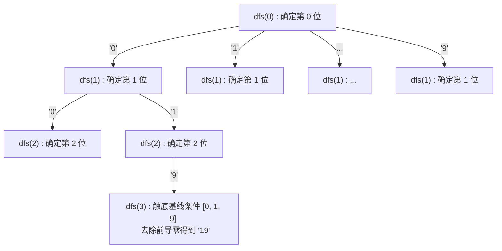

{/* 知识点清单：大数溢出 / 字符串表示法 / 回溯递归 / 全排列算法 / 前导零处理；原书章节：面试题17：打印从1到最大的n位数。 */}

<Objectives>

- 能解释为什么在 $n$ 较大时标准的整型或长整型循环会发生溢出，并说明如何用字符串或字符数组承接超大数字。
- 能阐述将「打印大数问题」转化为「数字字符全排列问题」的回溯思考路径，并画出其递归决策树。
- 能熟练编写出定位首个非零字符、剔除前导零并过滤全零状态的切片处理算法。
- 能推导回溯生成全排列的时间复杂度 $O(10^n)$ 与空间复杂度 $O(n)$。
- 能给出大 $n$ 情况下防御系统递归调用栈溢出的去递归优化方案。

</Objectives>

## 直觉引入

想象你面前有一个三位的滚轮密码锁或水表表盘。表盘上有三个数字槽位，初始状态是 `[0, 0, 0]`。
如果你要把表盘上能表示的所有数字全部滚过一遍（从 `001` 到 `999`），你会怎么做？

你肯定会这样做：
1. 拨动个位，从 `0` 到 `9` 依次旋转。
2. 当个位转满一圈回到 `0` 时，十位进位变成 `1`，然后个位继续从 `0` 到 `9` 拨动。
3. 当个位和十位都转满一圈时，百位进位变成 `1`，如此往复。

这个密码锁的表盘，实际上就是一个固定长度为 3 的**槽位容器**。无论我们要填写的数有多大，我们只需要关注：**每一位（百位、十位、个位）在字符 `'0'` 到 `'9'` 之间枚举并向下推进**。

这道题表面上看起来是一个简单的自增循环打印问题。但在面试中，它往往伴随一个致命的隐蔽边界：如果 $n$ 非常大（例如 $n = 100$），任何标准的数值类型在表示 $10^{100}-1$ 时都会**瞬间溢出崩溃**。
通过表盘槽位旋转的直觉，我们可以转而使用**字符数组**来作为存储数字的容器，通过**递归全排列回溯**，将超大数值逐位生成并打印出来。

---

## 概念讲解

在常规的算法题中，我们可能会写出类似 `for (let i = 1; i <= max; i++)` 的代码。但当 $n$ 很大时，这种方法会彻底失效。

### 为什么常规整型会失效？

对于不同的位宽，$n$ 位数对应的最大整数为 $10^n - 1$：
- 在 32 位有符号整型下，最大值为 `2147483647`（只够容纳 $n \le 9$）。
- 在 64 位有符号整型下，最大值为 `9223372036854775807`（只够容纳 $n \le 18$）。
- 在 JavaScript 中，安全整数上限 `Number.MAX_SAFE_INTEGER` 为 $2^{53} - 1 \approx 9 \times 10^{15}$（只够容纳 $n \le 15$）。

当 $n \ge 20$ 时，所有的基础整数类型都会溢出，导致精度丢失、负值回绕或者死循环。因此，我们必须引入 <Term def="使用字符串、字符数组或链表等自定义结构来表达并计算超出计算机硬件寄存器限制的超大数值的方法。">大数表示法</Term>。

---

### 全排列回溯算法的核心步骤

为了在不引发数值溢出的前提下生成所有 $n$ 位数，我们可以将问题转化为**对 $n$ 个槽位进行字符 `'0'`-`'9'` 的全排列**。



#### 1. 递归回溯结构
我们定义一个长度为 $n$ 的字符数组作为表盘，并从最高位（索引 0）开始向下递归。
递归函数 `dfs(index)` 代表「当前正在填充第 `index` 位」：
- **分支选择**：在当前位，循环尝试填入 `'0'` 到 `'9'` 这 10 种可能。
- **向下递推**：填完当前位后，立即递归调用 `dfs(index + 1)`，以确定下一位的值。
- **基线条件**：当 `index === n` 时，说明所有槽位均已填满。此时代表已成功构造出一个完整的排列状态，可以对其进行处理和输出。

#### 2. 去除前导零（Leading Zeros）与全零过滤
因为全排列会生成诸如 `001`、`023` 甚至是全零 `000` 这样的状态，而题目要求打印从 `1` 开始的自然数，因此在输出前必须进行修剪：
- 从左向右扫描生成的字符数组，定位第一个不是 `'0'` 的字符的位置 `firstNonZero`。
- 如果遍历完整个数组都没有发现非零字符，说明该数是全零 `000`，应直接过滤掉。
- 否则，截取从 `firstNonZero` 开始到数组末尾的子串，这就是去除前导零后的合法大数字符串。

#### 3. 复杂度分析
- **时间复杂度**：$O(10^n)$。每一位有 10 种可能性，生成全部排列节点数为 $10^n$。在叶子节点处做截取和字符串合并需要 $O(n)$ 时间，通常在分析指数级别问题时将其复杂度计为 $O(10^n)$。
- **空间复杂度**：$O(n)$。我们使用了一个长度为 $n$ 的数组来暂存当前生成的数字路径，并且递归树的最大深度为 $n$，系统压栈深度同样为 $n$。

---

## 交互演示

在下方的交互 Stepper 中，我们以 $n=3$ 为例，模拟全排列算法在特定关键帧下的分配状态、调用栈深度以及控制台实时输出流。
通过点击「下一步」可以追踪回溯与前导零剥离的动态过程：

<BigNumberPrintDiagram />

---

## 代码对照

以下是利用递归全排列回溯生成大数的最优方案对照。

<CodeTabs>
  <Tab label="C++">
```cpp
#include <iostream>
#include <vector>
#include <string>

class Solution {
private:
    std::vector<std::string> result;
    std::string path;

    // 回溯递归函数，确定 index 位置的字符
    void dfs(int index, int n) {
        // 基线条件：所有槽位均已填满
        if (index == n) {
            // 从左向右定位首个非零字符以去除前导零
            int firstNonZero = 0;
            while (firstNonZero < n && path[firstNonZero] == '0') {
                firstNonZero++;
            }
            // 过滤全 0 状态（不输出 0），其余结果截取加入列表
            if (firstNonZero < n) {
                result.push_back(path.substr(firstNonZero));
            }
            return;
        }

        // 枚举字符 '0' 到 '9' 并填入当前位
        for (char c = '0'; c <= '9'; ++c) {
            path[index] = c;
            dfs(index + 1, n); // 向下推进递归
        }
    }

public:
    std::vector<std::string> printNumbers(int n) {
        if (n <= 0) return {};
        result.clear();
        path = std::string(n, '0'); // 初始化大小为 n 的字符数组
        dfs(0, n);
        return result;
    }
};
```
  </Tab>
  <Tab label="TypeScript">
```typescript
function printNumbers(n: number): string[] {
  if (n <= 0) return [];
  const res: string[] = [];
  const path: string[] = Array(n).fill("0");

  // 递归确定 path[index] 处的值
  function dfs(index: number): void {
    // 递归终止：所有 n 位均已填满
    if (index === n) {
      // 遍历定位首个非零字符的位置
      let firstNonZero = 0;
      while (firstNonZero < n && path[firstNonZero] === "0") {
        firstNonZero++;
      }
      // 仅当首个非零索引在有效范围内时（过滤全 0），才加入结果集
      if (firstNonZero < n) {
        res.push(path.slice(firstNonZero).join(""));
      }
      return;
    }

    // 回溯尝试 '0' - '9'
    for (let i = 0; i <= 9; i++) {
      path[index] = String(i);
      dfs(index + 1); // 递归至下一层
    }
  }

  dfs(0);
  return res;
}
```
  </Tab>
</CodeTabs>

---

## 常见误区

<Callout type="trap">
  <strong>现象 →</strong> 在去前导零的循环中，直接写出类似 `if (str[i] != '0') return str.substr(i);` 的逻辑，但是在输入为 `000` 时，函数直接崩掉或返回了空字符串 `""`，这会被误存进输出列表中。
  <strong>原因 →</strong> 当数组内全部为 `'0'` 时，首个非零索引值 `firstNonZero` 会递增到与数字长度 $n$ 相等。如果不加过滤条件限制，盲目调用 `slice(n)`，就会生成一个空字符串并塞入输出列表，这不符合题目要求「从 1 开始打印」的设定。
  <strong>修法 →</strong> 在获取首个非零索引后，务必前置拦截 `if (firstNonZero < n)`，只有满足该条件的有效数值才能加入结果集中。
</Callout>

<Callout type="trap">
  <strong>现象 →</strong> 面试官把 $n$ 限制放宽到 $10^5$，执行递归算法时，直接触发了 `Stack Overflow`（系统调用栈溢出）。
  <strong>原因 →</strong> 递归栈的深度与 $n$ 的大小成正比。如果 $n = 10^5$，则递归树深度达到 $10^5$，由于每个函数压栈会携带局部变量和上下文，远远超过了 C++ 默认的 $1\text{MB}$ 调用栈或者 JS 引擎的栈深度限制。
  <strong>修法 →</strong> 当 $n$ 极大时，必须使用**非递归迭代模拟大数加法**（手动模拟计数器个位加一并向前进位）。在堆内存中维护字符数组，消除对系统递归调用栈的依赖，使得空间消耗限制在常数栈空间。
</Callout>

---

## 小结与练习

- 为了彻底屏蔽大数运算下的数值溢出，最根本的防御方案是使用**字符串或字符数组**存储大数。
- 利用**全排列**，我们可以通过回溯穷举出所有数位组合，并将大数生成任务降维转化为数位字符填充。
- 递归树的最深深度与数字的位数 $n$ 保持一致，空间复杂度为 $O(n)$。而状态生成在叶子节点触底，总的时间开销为 $O(10^n)$。

<Exercises>
  <Answer question="如果不采用最后在叶子节点处 slice 截取前导零的方式，我们如何在递归中『直接』生成无前导零的数字串？">
    我们可以通过「动态枚举数字长度」来做递归剪枝：
    1. 外层设立一个循环，控制当前生成数字的有效位数 `len` 从 1 循环到 $n$。
    2. 在为长度为 `len` 的数字填充第一位（最高位）时，强制其候选字符必须在 `'1'`-`'9'` 范围内进行选择。
    3. 后续的 `len - 1` 位，再恢复在 `'0'`-`'9'` 范围内正常排列。
    4. 这样，每一次在 `index === len` 触底时，所拼合出的字符串天生就是无前导零的有效数据，并且避免了生成大量无用 `'0'` 状态的额外开销。
  </Answer>
  <Answer question="在大数模拟加法中，我们如何判断数字已经累加到了最大值（例如 3 位下的 999），从而主动停止循环？">
    我们可以在模拟大数加 1 的函数中设置一个溢出标志：
    每次加 1 自增时，如果最高位（字符数组的索引 0 处）在加 1 后发生进位（即值变为 10，被重置为 '0'，且产生向更高位的进位标志），就表明当前数值已经突破了 $n$ 位数能表示的极限（即产生了第 $n+1$ 位进位）。这时加法函数向外返回一个「溢出/结束」布尔值，外层循环捕获到该值后即可主动 break 停止累加。
  </Answer>
</Exercises>

## 名词解释

<Glossary>
  <GlossaryItem term="大数表示法">
    在计算机编程中，使用字符串、字符数组或自定义高精度链表来存放超长数值，并通过手写进位算法执行加减乘除以规避硬件溢出的高精度运算方案。
  </GlossaryItem>
  <GlossaryItem term="回溯法">
    一种通过在决策树中尝试各个分支并进行深度优先搜索来寻找问题解的系统性方法。当搜索在某一条路径上发现无法满足约束条件时，会退回上一个决策点继续尝试其他分支。
  </GlossaryItem>
  <GlossaryItem term="调用栈溢出（Stack Overflow）">
    当程序执行的函数嵌套深度过深，或者局部变量过多，导致为当前执行线程分配的栈段（Stack Segment）空间耗尽，从而引发操作系统或运行环境强制中止程序的运行时错误。
  </GlossaryItem>
</Glossary>

<Attribution
  adaptedFrom="Coding Interviews, Second Edition"
  adaptedUrl="https://github.com/zhedahht/CodingInterviews"
/>
